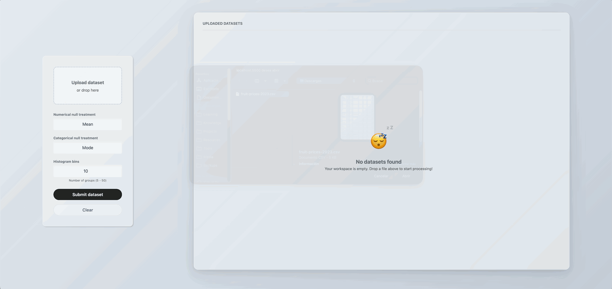
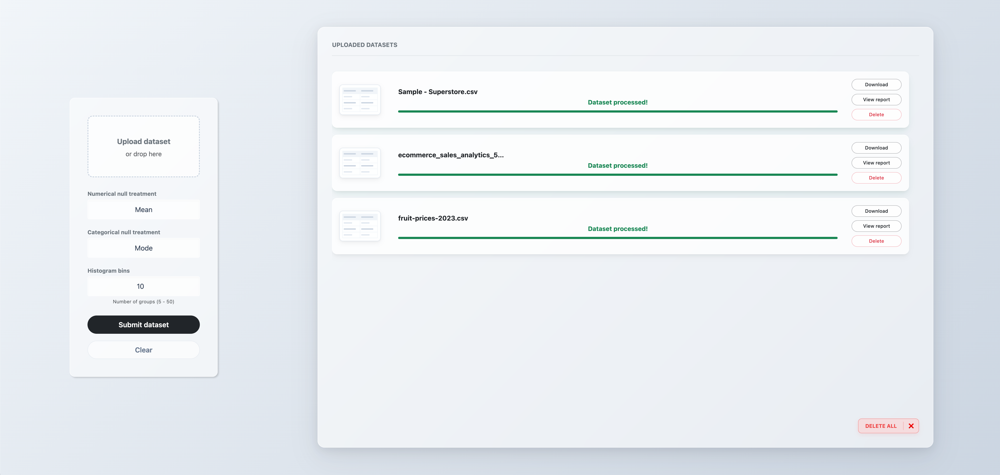
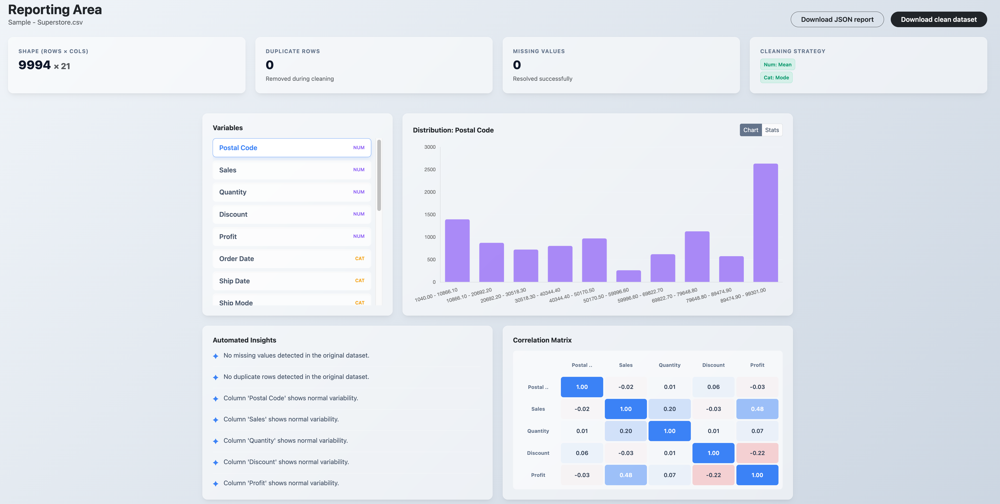
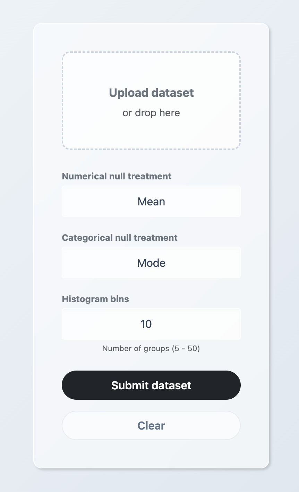
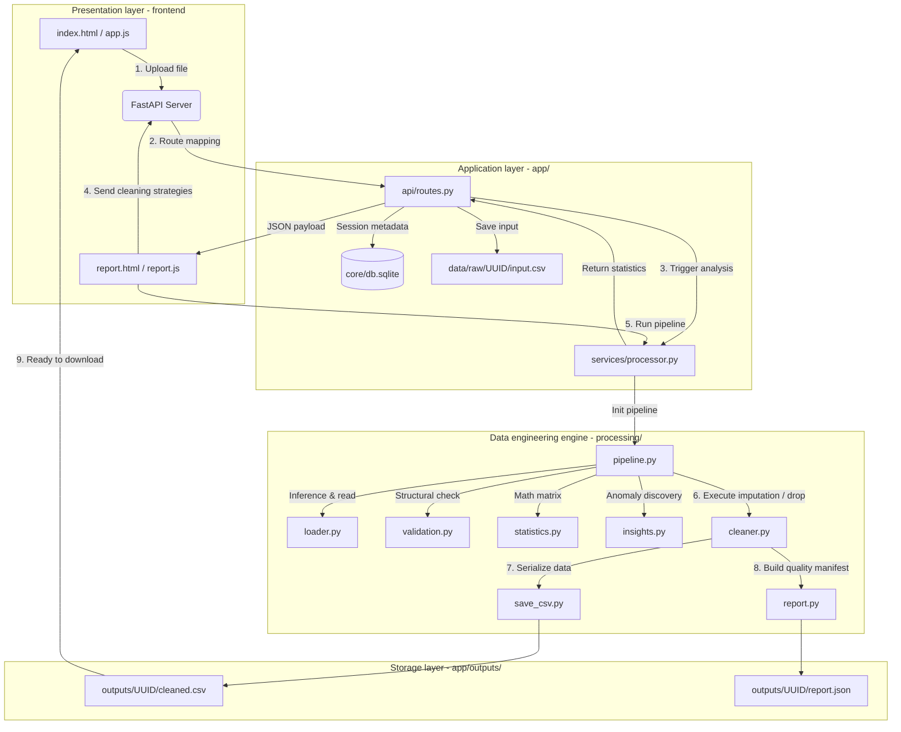

<div align="center">

# Dataset Cleaner

**An autonomous, local-first web application and engine for instant data sanitization, missing value imputation, and profiling.**

[](https://www.python.org/)
[](https://fastapi.tiangolo.com/)
[](LICENSE)
[](CONTRIBUTING.md)

</div>

---

## Demo & interface overview

Experience the end-to-end data sanitization workflow in seconds:



*The automated pipeline ingests raw datasets, computes mathematical profile reports, applies selected cleaning strategies, and delivers sanitized CSV exports in real time.*

---

### Dashboard highlights

<div align="center">

#### 1. Glassmorphic data ingestion
*Drag-and-drop interface with instant session UUID isolation and format validation.*



#### 2. Analytical data health report
*Interactive profiling panel showing matrix dimensions, duplicate counts, and missing value distribution.*



#### 3. Execution & configuration panel
*Strategy selection for numeric and categorical imputation before pipeline execution.*




</div>

## Why this project?

Data preprocessing consistently consumes up to 80% of a data scientist's or developer's timeline. When handling common, recurring operations—such as data profiling, row deduplication, and missing value imputation—teams are usually forced into a frustrating trade-off:

*   **Scripting overhead**. Writing repetitive, boilerplate Pandas or Polars scripts, which requires manually setting up virtual environments, managing dependency conflicts, and wrestling with modern system-level package barriers (like PEP 668).
*   **The heavyweight overkill**. Deploying cloud-native ETL enterprise platforms or complex BI suites that introduce steep learning curves, massive configuration friction, and data privacy compliance concerns.

### Strategic positioning

*Dataset Cleaner* bridges this exact gap. It is engineered as a **localized, zero-configuration desktop-grade web utility** designed for instantaneous data sanitization. 

By combining an autonomous environment orchestrator (`run.py`) with a completely decoupled data engineering engine and a glassmorphic interface, it delivers production-ready data cleaning without the infrastructural tax. Your data remains entirely local, securely isolated via session UUIDs, and processed within milliseconds.


## Features

### Core data engineering engine
*   **Framework-agnostic processing**. The core logic resides entirely within the decoupled `processing/` package, exposing a pure Python interface that operates independently of the web application layer.
*   **In-memory matrix manipulation**. Built on top of high-performance data vectorization to ingest raw data structures (CSV and Excel formats via `loader.py`) into optimized in-memory dataframes for low-latency operations.
*   **Deterministic imputation pipelines**. Implements context-aware mathematical imputation algorithms:
    *   *Continuous series*. Arithmetic mean substitution for missing numerical dimensions.
    *   *Discrete series*. Statistical mode/frequency substitution for missing categorical string attributes.
*   **Matrix deduplication**. Performs complete multi-column matrix tracking to identify and remove exact redundant records while preserving the initial entry pointer.

### Asynchronous application architecture
*   **Asynchronous I/O controllers**. Built with **FastAPI** utilizing native Python `async/await` syntax to prevent blocking worker threads during concurrent heavy file uploads and analysis routines.
*   **Session isolation & data sandboxing**. Implements high-concurrency security boundaries by generating unique, cryptographically secure UUIDv4 tokens for every upload session. File systems are strictly partitioned into isolated directories (`app/data/raw/{uuid}` and `app/outputs/{uuid}`) to prevent cross-session data leakage.
*   **Lightweight persistence layer**. Utilizes a decoupled SQLite relational database (`core/db.sqlite`) coupled with the Repository pattern (`dataset_repository.py`) to manage schema state, session lifecycle logs, and processing metadata.
*   **State integrity & cache control**. Configured with custom HTTP delivery middleware to inject aggressive cache-control headers (`Cache-Control: no-store, no-cache, must-revalidate`) at the protocol level, preventing browsers from rendering stale evaluation data or caching sensitive datasets.

### Environment automation & DX (developer experience)
*   **Runtime environment inversion**. The root-level orchestrator (`run.py`) dynamically evaluates the host operating system's execution context. It enforces **PEP 668 compatibility** by programmatically provisioning an isolated virtual environment (`.venv`) to completely bypass system-level environment write barriers.
*   **Dynamic dependency resolution**. Automates host configuration by auditing and updating third-party libraries out-of-the-box using standard requirements streams (`requirements.txt`).
*   **PYTHONPATH injection**. Dynamically alters the sys-path at runtime, ensuring correct top-level relative module imports across the standalone processing layer and the application layer without requiring manual user environment variable configurations.


## Quick start

We designed *Dataset Cleaner* to get you from zero to cleaning data in under a minute. You do not need to manually configure virtual environments or manage dependency installations—our root orchestrator handles the entire setup autonomously.

### Prerequisites

Before bootstrapping the application, ensure you have **Python 3.10+** and `git` installed on your machine.

### 1. Clone the repository

```bash
git clone https://github.com/VR-Alejandro/dataset-cleaner.git
cd dataset-cleaner
```

### 2. Run the orchestrator

Execute the execution script matching your operating system:

**On macOS / Linux**:

```bash
python3 run.py
```
**On Windows**:

```bash
python run.py
```

**What happens behind the scenes?** The `run.py` script instantly detects or provisions an isolated virtual environment (`.venv`), safely bypassing any PEP 668 environment barriers. It then installs all required libraries from `requirements.txt`, injects the necessary module routing paths, launches the FastAPI server, and automatically opens the visual glassmorphic dashboard in your default browser at `http://127.0.0.1:5500`.


## How it works

*Dataset Cleaner* utilizes a decoupled, event-driven data pipeline. The presentation layer (web UI) communicates asynchronously with a structured FastAPI backend, which hands off the execution heavy lifting to an isolated data engineering engine (`processing/`).

### System architecture diagram

The diagram below reflects how a user request traverses the system layers, using unique session tokens (UUIDs) to guarantee data isolation:



---

### The data lifecycle

Understanding what happens behind the scenes when you drop a dataset:

* **Ingestion & isolation**. When a dataset is uploaded via the glassmorphic UI, `app/api/routes.py` intercepts the request, generates a secure cryptographically random UUID, and isolates the raw file under `app/data/raw/{UUID}/input.csv`. Session metadata is simultaneously recorded into the SQLite tracking base (`app/core/db.sqlite`).

* **Structural validation & profiling**. The controller invokes `app/services/processor.py`, which initializes the core processing pipeline (`processing/pipeline.py`). Before reading the file matrix, `validation.py` inspects file integrity. Once passed, `loader.py` loads the data into memory, and `statistics.py` computes mathematical descriptive metrics (counts, shapes, missing allocations) along with `insights.py`.

* **UI sync (state extraction)**. This statistical matrix is dispatched back as a structured JSON payload to `report.html`, rendering the localized metrics for user review.

* **Transformation pipeline execution**. Once the user submits their selected strategies from the UI, the platform triggers `processing/cleaner.py`. The engine targets missing elements or duplicates row-by-row and column-by-column according to the selected mapping (`drop`, `mean`, `mode`).

* **Serialization & delivery**. The data engineering engine completes the transformations. `save_csv.py` commits the sanitized dataframe to `app/outputs/{UUID}/cleaned.csv`, while `report.py` saves a final execution manifest to `report.json`. The frontend updates its context and displays the safe download trigger.


## Usage guide

To help you get started immediately, *Dataset Cleaner* comes pre-packaged with dummy datasets inside the `sample_data/` directory. Follow this step-by-step walkthrough using `sample_data_01.csv` to see the pipeline in action.

---

### Step 1: Launch the platform

Open your terminal in the root directory of the project and execute the orchestrator:

```bash
python run.py
```

The script will handle the environment setup and automatically open your default web browser at:

```
http://127.0.0.1:5500
```

---

### Step 2: Upload the sample dataset

On the main dashboard (`index.html`), locate the glassmorphic drag-and-drop file upload zone.

Click on it or drag the file located at:

```
sample_data/sample_data_01.csv
```

The backend will instantly ingest the file, isolate a session ID, and redirect you to the reporting view.

---

### Step 3: Inspect the data health report

Once the file is processed, the Report Dashboard (report.html) will display an analytical overview of your raw data:

* **Total rows & columns**. Basic shape metrics of the matrix.
* **Missing data heatmap/list**:
  
  You will notice that `sample_data_01.csv` contains:
  - Missing numerical values in the "Age" column
  - Missing categorical values in the "City" column
* **Duplicate counter**. The system will flag exact duplicate entries found in the file.

---

### Step 4: Configure the cleaning strategy

In the configuration panel beneath the statistics, select the target strategies for this example:

* **Duplicates**:
  
  Toggle "Remove Full Duplicates" to clean redundant rows.

* **Numerical columns (e.g., Age)**:
  
  Select "Mean Imputation" to automatically calculate the average and fill missing values.

* **Categorical columns (e.g., City)**:

  Select "Mode Imputation" to replace missing values with the most frequent category.

* **Histogram groups**:
  
  Select the number of groups you want to see in the histogram related to each numerical column.

Click on the "Submit Dataset" button.

---

### Step 5: Download your cleaned data

The core data engineering engine (`processing/`) will execute the transformations in milliseconds.

* A success message will appear on the interface.
* Click "**Download clean dataset**" to retrieve your processed file (cleaned.csv).

Your dataset is now:

* Free of duplicates
* Fully imputed
* Ready for downstream ML models or analytical workflows


## Configuration

The application allows users to configure cleaning strategies through the glassmorphic UI before executing the processing pipeline. The backend engine currently evaluates and applies these rules globally across the uploaded dataset.

### Current supported strategies

*   **🧩 Missing value imputation (`NaN` handling)**:
    *   `Drop`. Removes any row containing missing values (applicable to both numerical and categorical columns).
    *   `Mean`. Imputes missing values in **numerical variables** using the column's mathematical average.
    *   `Mode`. Imputes missing values in **categorical variables** using the column's most frequent value.
*   **👯 Duplicate handling**:
    
    ***Dataset Cleaner*** scans the entire dataset matrix and eliminates exact redundant row duplicates, keeping the first occurrence.

### Planned configuration upgrades

To shift from global operations to granular data control, our upcoming releases will introduce:

*   **🎛️ Column-level configuration**. A dynamic UI matrix allowing users to assign different cleaning strategies (e.g., `mean` for Column A, `drop` for Column B) within the same run.
*   **🛠️ Custom transformation pipelines**. The ability to inject user-defined thresholds for anomaly removal and basic string formatting rules directly from the interface.


## Project structure

This project follows a modular, layered architecture that strictly separates the web application layer from the core data processing engine.

```text
dataset-cleaner/
├── app/                        # Web application layer (FastAPI backend & UI)
│   ├── api/                    # HTTP route definitions and API endpoints
│   ├── core/                   # Application configurations and DB initializers
│   ├── data/                   # Internal application database and raw user uploads
│   ├── domain/                 # Core domain models and business entities
│   ├── frontend/               # Glassmorphic user interface (HTML, CSS, JS components)
│   ├── logs/                   # System runtime log files
│   ├── main.py                 # FastAPI application bootstrapper
│   ├── outputs/                # User-specific processed outputs and JSON reports
│   ├── repositories/           # Data access layer (Repository pattern implementation)
│   ├── schemas/                # Request/response validation schemas (Pydantic models)
│   └── services/               # Internal business logic and system services
├── data/                       # Root-level persistent data storage
├── processing/                 # Core processing engine (pure data engineering layer)
│   ├── cleaner.py              # Null handling and duplicate removal logic
│   ├── exceptions.py           # Custom pipeline error definitions
│   ├── insights.py             # Data observation and anomaly discovery algorithms
│   ├── loader.py               # Data ingestion handlers for CSV/Excel file formats
│   ├── pipeline.py             # Sequential cleaning workflow orchestrator
│   ├── report.py               # Data health report synthesis logic
│   ├── save_csv.py             # File serialization and write operations
│   ├── statistics.py           # Descriptive mathematical and statistical calculation helpers
│   └── validation.py           # Structural file and column schema validation
├── sample_data/                # Pre-packaged dummy datasets for instant testing
├── CONTRIBUTING.md             # Guidelines for open-source developers
├── LICENSE.txt                 # Project legal terms (MIT License terms)
├── README.md                   # Main project documentation
├── requirements.txt            # Unified project Python dependencies
└── run.py                      # Root orchestrator (auto-venv manager & instant launcher)
```

### Architectural highlights

* **processing/ (engine)**. Completely decoupled from the web framework. This module acts as a pure data engineering library. It handles validations, calculates statistical metrics, and executes row-by-row or column-by-column cleaning strategies independently of how data is gathered.

* **app/ (interface)**. Built following decoupling patterns (Domain, Service, Repository, Controller). It abstracts infrastructure concerns like SQLite storage, HTTP mapping, and serves the decoupled vanilla JS/CSS glassmorphic presentation layer from app/frontend/.

* **run.py & requirements.txt**. Located at the root level to simplify environment initialization, allowing immediate bootstrapping of both the core engine and the web server dependencies in one isolated ecosystem.

## Roadmap

We have exciting plans for the future of *Dataset Cleaner*. Here is what we are planning to work on next. Contributions in these areas are highly encouraged!

### 🟢 Short-term (next releases)
*   **Column-wise cleaning rules**. Transition from global cleaning strategies to granular, column-by-column configurations in the UI.
*   **Interactive distribution charts**. Enhance the reporting window with responsive, glassmorphic charts showing data distribution changes before and after cleaning.
*   **Dockerization**. Provide an official `Dockerfile` for alternative, containerized local deployments.

### 🟡 Mid-term (feature expansion)
*   **Advanced anomaly detection**. Implement statistical outlier detection (e.g., IQR and Z-Score methods) with visual indicators.
*   **Headless mode (API-first)**. Fully document endpoints and CLI triggers to enable dataset cleaning via terminal or external API requests without launching the GUI.
*   **Recipe export**. Allow users to download a `.json` or `.yaml` configuration file containing their cleaning choices to re-apply them to identical datasets instantly.

### 🔵 Long-term (ecosystem integration)
*   **ML pipeline code generator**. Add a feature to export the interactive cleaning workflow directly into ready-to-use Python/Pandas code that can be embedded into Sklearn or Airflow pipelines.

## Limitations

While *Dataset Cleaner* is powerful for everyday data cleaning tasks, it is important to note its current technical boundaries:

*   **In-memory processing**. It handles data directly in the local machine's RAM, meaning it is not optimized for very large datasets (>1GB).
*   **Focused scope**. Anomaly and outlier detection capabilities are limited to structural issues (nulls, duplicates, data types), without advanced statistical or ML-based modeling.
*   **Single-node execution**. The application runs entirely on a single local process; it does not feature distributed processing (e.g., Spark or Dask support).

## Contributing

Contributions are welcome.

Please read [CONTRIBUTING.md](CONTRIBUTING.md) for:

- Development workflow
- Coding standards
- Pull request guidelines

## License

This project is licensed under the MIT License. See the [LICENSE](LICENSE.txt) file for details.
